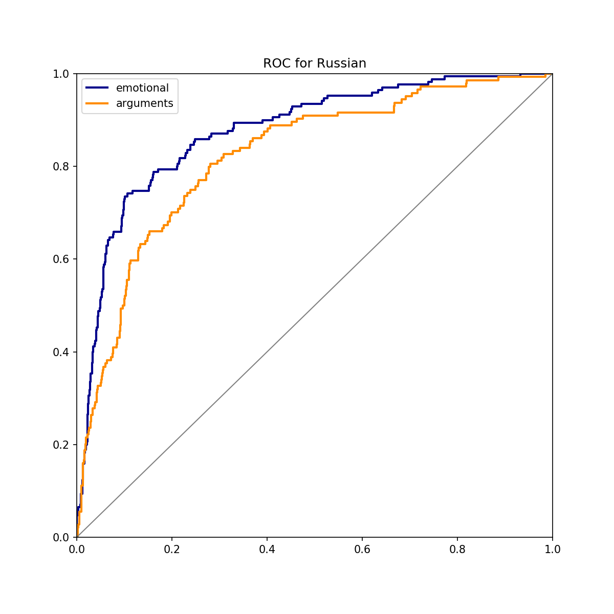
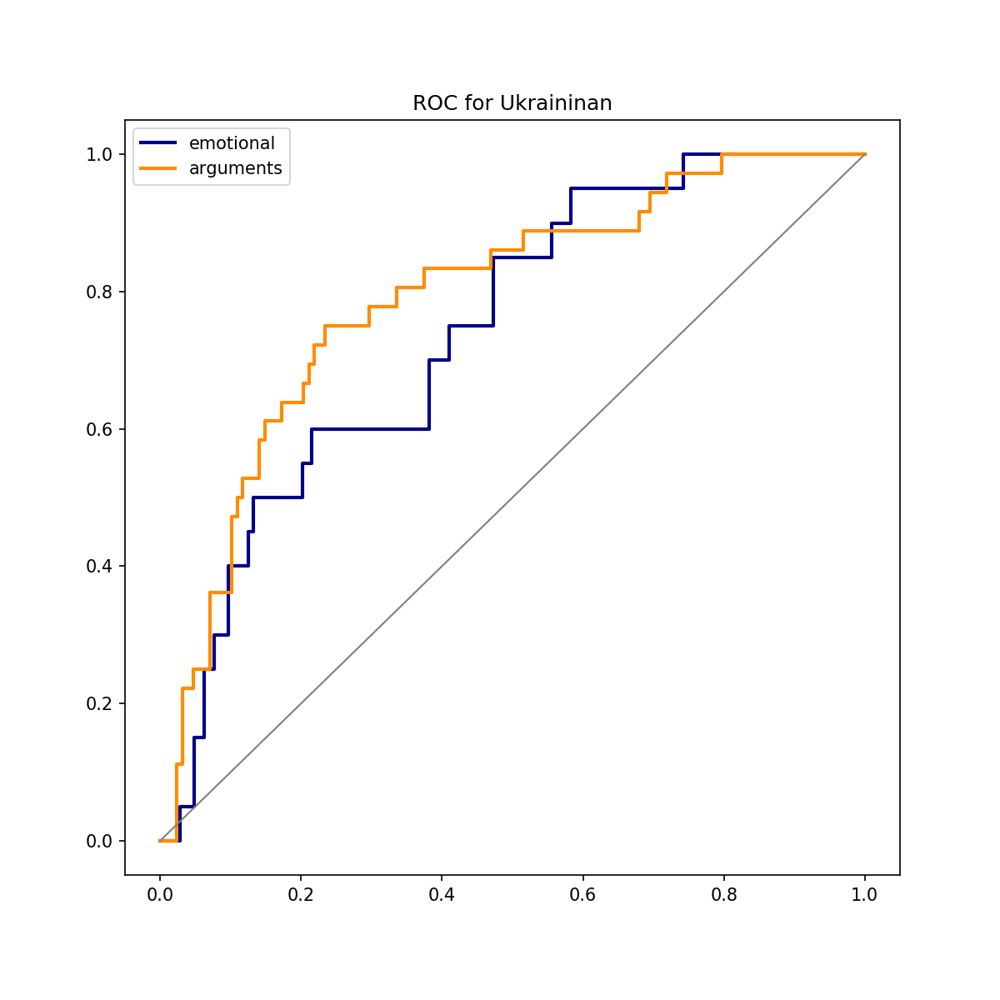
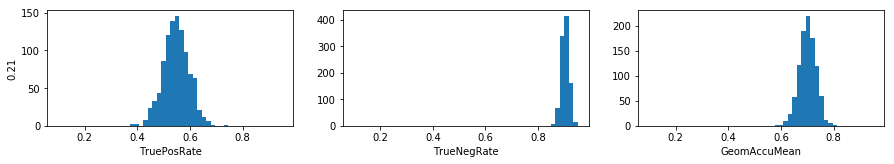

### How we used NLP to analyse more then 2 millions of news items from hundreds of "junk sites"
#### This is methodology for "We've got a bad news" project [in English](http://texty.org.ua/d/2018/mnews/eng/) 

### Repository structure
* [`classifier`](/classifier) - scripts for training and applying language model classifier
* [`data_collection`](/data_collection) - scripts to load RSS feeds, Facebook feeds of selected sites, and scrapy project to load html for each article
* [`data_processing`](/data_processing) - scripts to prepare data for classifier
* [Aggregated ranking](https://docs.google.com/spreadsheets/d/114Anuo8eREUVj3LscPaZcQ7fpvIzxti_virynhUVftI/edit#gid=0) - grouped results for the whole database of news. In final product we do not consider Russian sites, big Ukrainian sites, and sites with less than 25% of manipulative news
* `.._annotation.csv` - annotated sample of news htmls. `html_id` - key id of article in data file, other columns - annotations
* [`cls_tool`](/cls_tool) - Django site for annotation

### Table of contents
 1. [Data](#data)
 2. [Annotation](#annotation)
 3. [Classification](#classification)
 4. [Final ranking](#final-ranking)

### Data
Scripts for data collection and their description are in [`data_collection`](/data_collection) folder. 

Data can be downloaded [here](http://texty.org.ua/d/2018/share/mnews/data_to_publish.jl.zip)(2Gb). `html_id` - key field, `ra_summary` - readability html of article page, `real_url` - link to article. 

Totally we collected 306 500 articles in Ukrainian and 2 301 000 articles in Russian. Next we filtered out articles not about Ukrainian politics and society (excluded celebrities, international news etc.). There were left 1 174 000 relevant articles in Russian and 227 400 articles in Ukrainian. Websites in final ranking totally produced 289 300 relevant articles.

Data for the project are news from around 200 websites, collected from December 2017 until Nowember 2018. For each site we collected RSS feed every hour as well as daily Facebook feeds. Breaks occured several times because of technical reasons. 

For every link from RSS or Facebook feed of site's page we downloaded full text and processed it using readability (by [Mozilla](https://github.com/mozilla/readability), and [Python readability](https://pypi.org/project/readability-lxml)) algorithm. Readability parsing errors occure in less than 5% of cases, without significant error rate for individual websites. Next we removed html tags and tokenized text.

### Annotation
Please find annotation tool in [`cls_tool`](/cls_tool) folder. 
We invited journalists with experience as newsfeed editor to label training set for training. Totally we collected 1300 relevant annotated articles in Ukrainian and 6000 in Russian. 
All annotators were interviewed, instructed about possible labels of manipulative news. During annotation we maintained Facebook group to discuss uncertainties and labeling in general. We controlled annotation quality by monitoring labels and time intervals between annotation (if time between two labels is enough to read the article). 
Inintially we used the following labels for annotation, text exactly as it was written in annotator instruction:

1. **Fully fictional news**  
2. **Manipulative title / click-bait**  
3. **Conspiracies / Pseudo-sciense**  
4. **Emotionally charged news**  
5. **Manipulations thrue bad argumentation**  
6. **Political conspiracies**  
7. **Normal text**  
8. **Other (non-relevant content)**  

Finally we selected only emotional manipulations and manipulative arguments. The notion of clickbait headlines turned to be ambiguous and we did not manage to build working classifier for this type of manipulation. The rest of manipulations occured rarely and there were not enough positive examples for training.

### Classification 

[`classifier`](/classifier) folder containes links to pretrained models, classification scripts, instructions on how to download libraries, and test datasets. 

We tried various NLP approaches to detect manipulation in news: bag-of-words and document vectors machine learning models, and LSTM on word vectors. Finally we used text classification with language model developed by [fast.ai](http://nlp.fast.ai/classification/2018/05/15/introducting-ulmfit.html). Code for training language models on Wikipedia corpus can be found [here](https://github.com/fastai/fastai/tree/master/courses/dl2/imdb_scripts). 

We used example code from [fast.ai course](https://github.com/fastai/fastai/blob/master/courses/dl2/imdb.ipynb)to train classifiers and found most of defaults working best for our data. We increased dropouts for training Ukrainian language classifier and added multilabel final layer to detect multiple manipulation types at once (multilabel classifier was as accurate as individual classifiers for each manipulation type or better).

Language model containes:
1. input layer of vocabulary size (up to 60 000 tokens that occur more than 10 times)
2. Embedding layser of size 400
3. 3 LSTM layers of 1150 cells each
4. Model output is the result of "concat pooling": last hidden LSTM state, max-pooling of LSTM states, and average LSTM state, up to `bptt` last activations. The size of LM output is 3 * embedding size 

Final feedforward layer for language model training is prediction of the news word. 
For classification we change the last layer to feedforward network with 50 and the 2 cells, since we have 2 categories to classify. In classification we changed default categorical cross-entropy loss to binary cross-entropy, and softmax activation to sigmoid in order to perform multilabel classification.

#### You can download and use all models according to project's license
* [Wikipedia language model for Russian, forward LSTM](http://texty.org.ua/d/2018/share/mnews/fwd_ru_lm.zip)
* [Wikipedia language model for Ukrainian, forward LSTM](http://texty.org.ua/d/2018/share/mnews/fwd_uk_lm.zip)
* [Finetuned on news corpus Wikipedia language model for Russian](http://texty.org.ua/d/2018/share/mnews/fwd_ru_finetuned_lm.zip)
* [Finetuned on news corpus Wikipedia language model for Ukrainian](http://texty.org.ua/d/2018/share/mnews/fwd_uk_finetuned_lm.zip)
* [Finetuned on news corpus Wikipedia language model for Russian, encoder only](http://texty.org.ua/d/2018/share/mnews/fwd_ru_finetuned_lm_enc.zip)
* [Finetuned on news corpus Wikipedia language model for Ukrainian, encoder only](http://texty.org.ua/d/2018/share/mnews/fwd_uk_finetuned_lm_enc.zip)
* [Classifier of relevant news in Russian](http://texty.org.ua/d/2018/share/mnews/ru_is_other_cls.zip)
* [Classifier of relevant news in Ukrainian](http://texty.org.ua/d/2018/share/mnews/uk_is_other_cls.zip)
* [Classifier of types of manipulation for Russian](http://texty.org.ua/d/2018/share/mnews/ru_arg_emo_cls.zip)
* [Classifier of types of manipulation for Ukrainian](http://texty.org.ua/d/2018/share/mnews/uk_emo_arg_cls.zip)

### Final ranking

in final ranking we left only sites with more than 200 relevant news and more that 25% of manipulative news. It is simple aggregation of classification results. 

Confusion matrix of classifier's prediction on validation set (threshould=0.41, True = this is emotionally manipulative item):

| Classifier's result ----->   | True       | False     |
|-------------------|----------|--------|
| Ground truth        |    |  |
| True        | 139   | 115 |
| False         | 123    | 1138 |

 
##### ROC-curves for classifiers (built on validation set):

ROC-curve Russian          |  ROC-curve Ukrainian
:-------------------------:|:-------------------------:
        |  

##### Modelled distribution of scores, share of positive examples (emotional news) in population is 20% 
* True Positive Rate: TPR = TP / (TP + FN) 
* True Negative Rate: TNR = TN / (TN + FP) 
* Geometric accuracy mean: GA = sqrt(TNR*TPR)
* TP - true positive, FP - false positive, etc

### Performance of Language Model
##### Language models' perplexities before and after finetuning
(Accuracy below is for language model(LM), not for classifier. Roughly, it's share of words, correсtly predicted by language model, after  some imput sequence).

LM on Wikipedia corpus was trained for max 30k dictionary, while in finetuning we used max 60k tokens 
<table cellspacing="0" border="0">
    <colgroup width="102"></colgroup>
    <colgroup span="6" width="85"></colgroup>
    <tr>
        <td height="17" align="left"> </td>
        <td colspan=3 align="center" valign=middle>ru</td>
        <td colspan=3 align="center" valign=middle>uk</td>
    </tr>
    <tr>
        <td height="17" align="left"> </td>
        <td align="left">loss</td>
        <td align="left">accuracy</td>
        <td align="left">perplexity</td>
        <td align="left">loss</td>
        <td align="left">accuracy</td>
        <td align="left">perplexity</td>
    </tr>
    <tr>
        <td height="17" align="left">wiki lm</td>
        <td align="right" sdval="6.2167" sdnum="1033;">6.2167</td>
        <td align="right" sdval="0.161100432339391" sdnum="1033;">0.1611</td>
        <td align="right" sdval="501.047045565212" sdnum="1033;">501.0470</td>
        <td align="right" sdval="5.34244" sdnum="1033;">5.34244</td>
        <td align="right" sdval="0.19629799760906" sdnum="1033;">0.1963</td>
        <td align="right" sdval="209.022102507982" sdnum="1033;">209.0221</td>
    </tr>
    <tr>
        <td height="17" align="left">after fine-tuning</td>
        <td align="right" sdval="3.4486" sdnum="1033;">3.4486</td>
        <td align="right" sdval="0.391530558996723" sdnum="1033;">0.3915</td>
        <td align="right" sdval="31.456322615499" sdnum="1033;">31.4563</td>
        <td align="right" sdval="3.53392" sdnum="1033;">3.5339</td>
        <td align="right" sdval="0.371091168017848" sdnum="1033;">0.3711</td>
        <td align="right" sdval="34.2579960919917" sdnum="1033;">34.2580</td>
    </tr>
</table>
